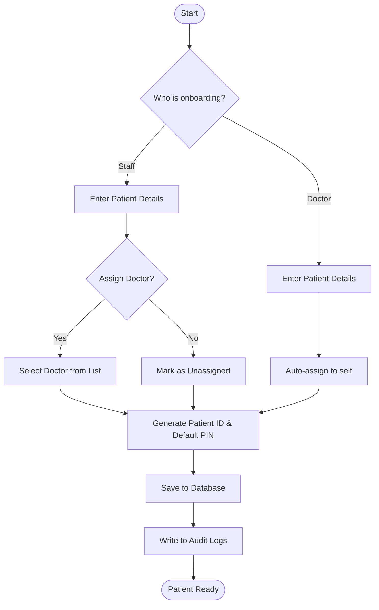
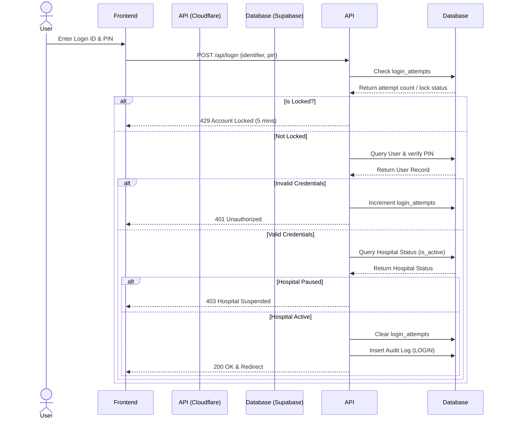
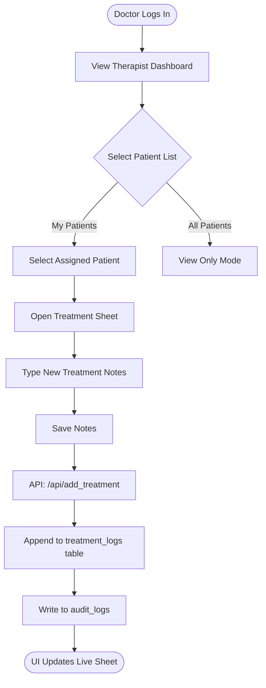

# PHYTNESS Healthcare - System Architecture & Workflows

**Version:** 1.0
**Project:** PHYTNESS Multi-Tenant Healthcare Management System

## 1. Project Overview

PHYTNESS is a multi-tenant cloud application designed to manage physiotherapy centres and hospitals. The system acts as a centralized platform allowing a global Super Admin to onboard multiple hospitals, assign staff and therapists, and oversee global audit logs. Each hospital operates in a strict multi-tenant environment, meaning staff and doctors can only interact with patients within their assigned facility.

## 2. Roles & Permissions

* **Super Admin**: Global oversight. Can register new Hospitals, provision Staff and Doctors, reset passwords, purge system logs, export hospital data to Excel, and pause/play (suspend) any hospital or user globally.
* **Hospital Staff**: Administrative personnel tied to a specific hospital. Responsible for patient onboarding, assigning patients to therapists, and managing the hospital directory.
* **Doctor / Therapist**: Medical professionals tied to a specific hospital. Responsible for evaluating assigned patients and maintaining continuous treatment report logs. Can act as a fallback to create patients if no staff is available.
* **Patient**: End-users who can log in to view their assigned therapist and rehab progress.

## 3. Database Architecture (Supabase / PostgreSQL)

The system relies on a robust relational database with the following core entities:

* `hospitals`: The multi-tenant anchor. Generates a unique prefix (e.g., `CH` for City Hospital).
* `staff` & `doctors`: Linked to a `hospital_id`. Login IDs are auto-generated using the hospital prefix (e.g., `CH-S01`, `CH-D01`).
* `patients`: Linked to a `hospital_id` and optionally an `assigned_doctor_id`.
* `treatment_logs`: A sequential append-only table linking a patient, doctor, and notes with automated timestamps.
* `audit_logs`: A global ledger tracking every significant action (Login, Create, Delete, Export) across the system.
* `login_attempts`: Tracks failed logins to enforce brute-force protection.

## 4. System Workflows

### 4.1. Patient Onboarding Flow (Flowchart)

### 4.2. Authentication & Rate Limiting (Sequence Diagram)

### 4.3. Treatment Reporting Flow (Flowchart)

## 5. Security & Features Summary

1. **Brute Force Protection**: 3 consecutive failed login attempts will lock the specific Login ID or Phone Number for 5 minutes.
2. **Multi-Tenant Isolation**: Every API endpoint strictly validates the `hospital_id` of the actor against the target entity to prevent cross-hospital data leaks.
3. **Admin Overrides**: Super Admins must re-authenticate (via PIN prompt) for highly destructive or sensitive actions like deleting a patient, purging logs, or exporting Excel data.
4. **Excel Export**: A dynamic client-side engine (SheetJS) converts complex relational data into multi-tab `.xlsx` workbooks for offline hospital analysis.
